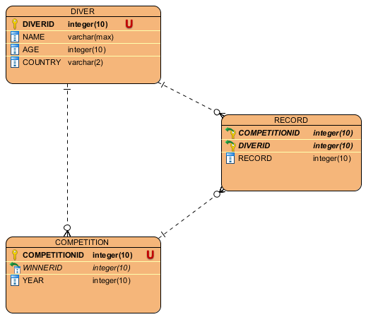

Parts Implemented by ANIL YILDIRIM
==================================

Database Tables
---------------

      Fig. 1: Entity Relationship Diagram for the DIVER, COMPETITION and RECORD Tables

DIVER table is the main table for diving section, contains sporters.
COMPETITION table refers to DIVER table, contains diving competitions.
RECORD table refers to both DIVER and COMPETITION tables, contains sporter records.

DIVER:
******

.. code-block:: plpgsql

   CREATE TABLE IF NOT EXISTS DIVER (
        DIVERID INTEGER PRIMARY KEY NOT NULL,
        NAME text,
        AGE INTEGER,
        COUNTRY text)

DIVER table contains information about diving sporters.It has 1 major column which is primary key and 3 other information columns.
DIVER table is independent from other tables, it references no other table.

DIVERID is the unique ID of the sporter.
NAME is the name of the sporter.
AGE is the age of the sporter.
COUNTRY is the country which sporter represents.

COMPETITION:
************

.. code-block:: plpgsql

   CREATE TABLE IF NOT EXISTS COMPETITION (
        COMPETITIONID INTEGER PRIMARY KEY NOT NULL,
        WinnerID INTEGER REFERENCES DIVER(DIVERID) ON DELETE RESTRICT ON UPDATE CASCADE,
        YEAR INTEGER)

COMPETITION table contains information about diving competitions.
References to DIVER table due to its foreign key WinnerID.

COMPETITIONID is the unique ID of a diving competition.
WINNERID is the ID of the sporter who won the competition.
YEAR is the date which the competition held.

RECORD:
*******

.. code-block:: plpgsql

      CREATE TABLE IF NOT EXISTS RECORD (
            COMPETITIONID INTEGER REFERENCES COMPETITION(COMPETITIONID) ON DELETE RESTRICT ON UPDATE CASCADE,
            DIVERID INTEGER REFERENCES DIVER(DIVERID) ON DELETE RESTRICT ON UPDATE CASCADE,
            RECORD INTEGER DEFAULT NULL,
            PRIMARY KEY(COMPETITIONID, DIVERID))

RECORD table contains information about sporters record at a specific competition.
It refers to both DIVER table and COMPETITION table via its foreign keys.
Primary key is the combination of COMPETITIONID and DIVERID.

CompetitionID is the unique ID of the competition.
DiverID is the unique ID of the sporter.
Record is the amount of height sporter dived from.

Class codes of Tables from diving.py:
*************************************
.. code-block:: python

   class Diver:
    def __init__(self, diverID, name, age, country):
        self.diverID = diverID
        self.name = name
        self.age = age
        self.country = country

   class Competition:
    def __init__(self, competitionID, winnerID, year):
        self.competitionID = competitionID
        self.winnerID = winnerID
        self.year = year

   class Record:
    def __init__(self, competitionID, diverID, record):
        self.competitionID = competitionID
        self.diverID = diverID
        self.record = record

Diving category codes from server.py file:
******************************************
add1, update1, delete1 and find1 refers to DIVER table.
add2, update2, delete2 and find2 refers to COMPETITION table.
add3, update3, delete3 and find3 refers to RECORD table.

.. code-block:: python

   @app.route('/diving', methods=['GET', 'POST'])
   def diving():
    ds = DiverStore(app.config['dsn'])

    if request.method == 'GET':
        return ds.firstrun()
    else:
        if 'add1' in request.form:
            diverID = request.form['id']
            name = request.form['name']
            age = request.form['age']
            country = request.form['country']
            return ds.add_diver(Diver(diverID, name, age, country), 1)
        elif 'add2' in request.form:
            competitionID = request.form['competitionID']
            winnerID = request.form['winnerID']
            year = request.form['year']
            return ds.add_diver(Competition(competitionID, winnerID, year), 2)
        elif 'add3' in request.form:
            competitionID = request.form['competitionID']
            diverID = request.form['diverID']
            record = request.form['record']
            return ds.add_diver(Record(competitionID, diverID, record), 3)

        elif 'update1' in request.form:
            diverID = request.form['id']
            name = request.form['name']
            age = request.form['age']
            country = request.form['country']
            searchID = request.form['select']
            return ds.update_diver(Diver(diverID, name, age, country), searchID, 1)
        elif 'update2' in request.form:
            competitionID = request.form['competitionID']
            winnerID = request.form['winnerID']
            year = request.form['year']
            searchID = request.form['select']
            return ds.update_diver(Competition(competitionID, winnerID, year), searchID, 2)
        elif 'update3' in request.form:
            competitionID = request.form['competitionID']
            diverID = request.form['diverID']
            record = request.form['record']
            combinedSearchID = request.form['select']
            return ds.update_diver(Record(competitionID, diverID, record), combinedSearchID, 3)

        elif 'find1' in request.form:
            diverID = request.form['id']
            name = request.form['name']
            age = request.form['age']
            country = request.form['country']
            return ds.find_diver(Diver(diverID, name, age, country), 1)
        elif 'find2' in request.form:
            competitionID = request.form['competitionID']
            winnerID = request.form['winnerID']
            year = request.form['year']
            return ds.find_diver(Competition(competitionID, winnerID, year), 2)
        elif 'find3' in request.form:
            competitionID = request.form['competitionID']
            diverID = request.form['diverID']
            record = request.form['record']
            return ds.find_diver(Record(competitionID, diverID, record), 3)

        elif 'recreate' in request.form:
            #  create new tables and add some rows
            ds.recreate()
            return redirect(url_for('diving'))
        elif 'return' in request.form:
            #  return to main diving page
             return redirect(url_for('diving'))

Add operation from diving.py file:
**********************************
.. code-block:: python

   def add_diver(self, data, table):
        try:
            ValidateInput(data, table)
        except ValueError:
            return render_template('Diving/InvalidValue.html', divers=divers)

        with dbapi2.connect(self.dbf) as connection:
            cursor = connection.cursor()
            query = ""

            if table == 1:
                query = """INSERT INTO DIVER (DIVERID, NAME, AGE, COUNTRY)
                            VALUES ('%s', '%s', '%s', '%s')""" % (data.diverID, data.name, data.age, data.country)
            elif table == 2:
                query = """INSERT INTO COMPETITION (COMPETITIONID, WinnerID, YEAR)
                            VALUES ('%s', '%s', '%s')""" % (data.competitionID, data.winnerID, data.year)
            elif table == 3:
                query = """INSERT INTO RECORD (COMPETITIONID, DIVERID, Record)
                            VALUES ('%s', '%s', '%s')""" % (data.competitionID, data.diverID, data.record)

            cursor.execute(query)
            connection.commit()
            return redirect(url_for('diving'))

Update operation from diving.py file:
*************************************
.. code-block:: python

   def update_diver(self, data, id, table):
        try:
            ValidateInput(data, table)
        except ValueError:
            return render_template('Diving/InvalidValue.html', divers=divers)

        with dbapi2.connect(self.dbf) as connection:
            cursor = connection.cursor()
            query = ""

            if table == 1:
                query = """UPDATE DIVER
                            SET DIVERID='%s', NAME='%s', AGE='%s', COUNTRY='%s'
                            WHERE (DIVERID = '%s')""" % (data.diverID, data.name, data.age, data.country, id)
            elif table == 2:
                query = """UPDATE COMPETITION
                            SET COMPETITIONID='%s', WinnerID='%s', YEAR='%s'
                            WHERE (COMPETITIONID = '%s')""" % (data.competitionID, data.winnerID, data.year, id)
            elif table == 3:
                ids = id.split('-')
                query = """UPDATE DIVER
                            SET COMPETITIONID='%s', DIVERID='%s', RECORD='%s'
                            WHERE ((COMPETITIONID = '%s') AND (DIVERID = '%s'))""" % (data.competitionID, data.diverID, data.record, ids[0], ids[1])

            cursor.execute(query)
            connection.commit()
            return redirect(url_for('diving'))

Delete operation from diving.py file:
*************************************
Deletes a record from database by ID

.. code-block:: python

   def delete_diver(self, id, table):
        with dbapi2.connect(self.dbf) as connection:
            cursor = connection.cursor()
            query = ""

            if table == 1:
                query = "DELETE FROM DIVER WHERE (DIVERID = '%s')" %(id)
            elif table == 2:
                query = "DELETE FROM COMPETITION WHERE (COMPETITIONID = '%s')" %(id)
            elif table == 3:
                ids = id.split('-')
                query = "DELETE FROM RECORD WHERE ((COMPETITIONID = '%s') AND (DIVERID = '%s'))" %(ids[0], ids[1])

            cursor.execute(query)
            connection.commit()
            return redirect(url_for('diving'))

Find operation from diving.py file:
***********************************
Find operation lets you find a record by using only a part of information.
By searching for name "J" you can find names with John and James.
For searching operation it is not neccesary to use data for all columns.

.. code-block:: python

   def find_diver(self, data, table):
        with dbapi2.connect(self.dbf) as connection:
            cursor = connection.cursor()
            query = ""

            if table == 1:
                if data.diverID == '':
                    data.diverID = '-1'
                if data.age == '':
                    data.age = '-1'

                data.name = data.name.upper()
                data.country = data.country.upper()
                query = """SELECT DIVERID, NAME, AGE, COUNTRY FROM DIVER
                            WHERE (
                            (('%s' = '-1') OR (DIVERID = '%s'))
                            AND( ('%s' = '' ) OR (UPPER(NAME) LIKE '%s') )
                            AND( ('%s' = '-1') OR (AGE = '%s') )
                            AND( ('%s' = '' ) OR (UPPER(COUNTRY) = '%s') )
                            )"""% (data.diverID, data.diverID, data.name, data.name+'%', data.age, data.age, data.country, data.country)
                cursor.execute(query)
                divers = cursor.fetchall()
                return render_template('Diving/searchdiver.html', divers=divers)

            elif table == 2:
                if data.competitionID == '':
                    data.competitionID = '-1'
                if data.winnerID == '':
                    data.winnerID == '-1'
                if data.year == '':
                    data.year == '-1'
                query = """SELECT * FROM COMPETITION
                            WHERE (
                            (('%s' = '-1') OR (COMPETITIONID = '%s'))
                            AND( ('%s' = '-1') OR (WinnerID = '%s') )
                            AND( ('%s' = '-1') OR (YEAR = '%s') )
                            )"""% (data.competitionID, data.competitionID, data.winnerID, data.winnerID, data.year, data.year)
                cursor.execute(query)
                competitions = cursor.fetchall()
                return render_template('Diving/searchcompetition.html', competitions=competitions)

            elif table == 3:
                if data.competitionID == '':
                    data.competitionID = '-1'
                if data.diverID == '':
                    data.diverID = '-1'
                if data.record == '':
                    data.record = '-1'
                query = """SELECT * FROM RECORD
                            WHERE (
                            (('%s' = '-1') OR (COMPETITIONID = '%s'))
                            AND( ('%s' = '-1') OR (DIVERID = '%s') )
                            AND( ('%s' = '-1') OR (RECORD = '%s') )
                            )"""% (data.competitionID, data.competitionID, data.diverID, data.diverID, data.record, data.record)
                cursor.execute(query)
                records = cursor.fetchall()
                return render_template('Diving/searchrecord.html', records=records)

Table creations from diving.py file:
************************************
.. code-block:: python

   def create_tables(self):
        with dbapi2.connect(self.dbf) as connection:
            cursor = connection.cursor()
            query = """CREATE TABLE IF NOT EXISTS DIVER (
                        DIVERID INTEGER PRIMARY KEY NOT NULL,
                        NAME text,
                        AGE INTEGER,
                        COUNTRY text)"""
            cursor.execute(query)

            query = """CREATE TABLE IF NOT EXISTS COMPETITION (
                        COMPETITIONID INTEGER PRIMARY KEY NOT NULL,
                        WinnerID INTEGER REFERENCES DIVER(DIVERID) ON DELETE RESTRICT ON UPDATE CASCADE,
                        YEAR INTEGER)"""
            cursor.execute(query)

            query = """CREATE TABLE IF NOT EXISTS RECORD (
                        COMPETITIONID INTEGER REFERENCES COMPETITION(COMPETITIONID) ON DELETE RESTRICT ON UPDATE CASCADE,
                        DIVERID INTEGER REFERENCES DIVER(DIVERID) ON DELETE RESTRICT ON UPDATE CASCADE,
                        RECORD INTEGER DEFAULT NULL,
                        PRIMARY KEY(COMPETITIONID, DIVERID))"""
            cursor.execute(query)

            connection.commit()
